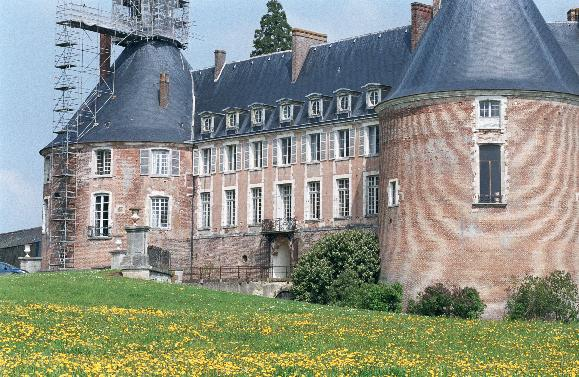
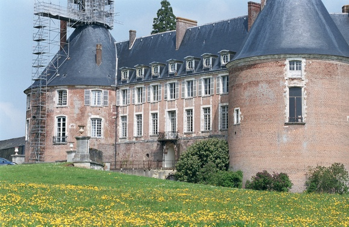

# 相机成像与ISP

## 相机成像

### CCD vs CMOS
- CCD：全称Charge Coupled Device，即电荷耦合器件
- CMOS：全称Complementary Metal Oxide Semiconductor，即互补金属氧化物半导体

这两种传感器都由多个光电二极管组成的阵列，每个光电二极管的作用是将接收到的光信号转化为电荷。两者的基本工作原理相似，传感器接收光信号并通过一定时间的电荷积累实现曝光，进而获得每个像素的光强度数据。最后，这些电荷经模数转换被转换为电压并经过放大处理，最终生成原始的RAW图像数据。

在具体的实现方式上，两者有一定的区别：
- CCD：每个像素点的电荷会被传输到一个单独的输出节点，通过这一节点将电荷转化为电压信号，即一行行读出。这种方式有助于实现较低的噪声和较高的图像质量，但由于传输过程中需要大量的电子元件和复杂的电路设计，CCD传感器的功耗较高，且读出速度较慢。
- CMOS：每个像素点都具有一个独立的放大器，能够在传感器内直接将电荷转化为电压信号并进行放大处理。这种方式使得每个像素的电荷转换过程相对独立，能更快速地读取图像数据，降低功耗，但在低光照环境下可能会产生较多噪声。


总的来看，CMOS传感器相比于CCD传感器，工艺简单、成本更低，随着CMOS技术的不断进步，尤其是在降低噪声、提高低光照性能和增强图像质量方面的提升，CMOS传感器已经逐渐取代了传统的CCD传感器，成为主流选择。当今CCD传感器的应用主要局限于一些对图像质量要求极高的专业领域。

### Bayer阵列与RAW图像
1.1节中提到，sensor通过将光强信号转化为电压信号，从而得到了RAW图像，因此，如果不加任何处理，得到的raw图将是只有亮度的黑白图像。

为了合成彩色图像，则需要得到每一个像素点处的RGB三通道的亮度值。要获得某个通道的亮度值，可以在光电二极管前加上只允许红/绿/蓝色光通过的滤光片。于是我们可以采用这样一种排列方式，四个滤光片依次按R、G、G、B排列。为什么是两个绿色呢，因为人眼对绿色更为敏感，所以这里使用两个绿色来增强绿色的解析力。这种排列方式又称Bayer阵列（Bayer Pattern），于1974由柯达的工程师Bayer提出。

 

除了最常用的Bayer阵列，一些厂商也采用了其他的排列方式，如索尼的REGB(红青绿蓝)，华为的RYYB(红黄黄蓝)，富士的乱七八糟排列（bushi

  


如果此时，我们将这些bayer排列的电信号转换成数字信号，并保存下来，就可以得到RAW图像。


此时的图像依旧是黑白的，并且如果放大局部，会发现图像会呈现马赛克一样的效果，为了得到最终的图像，需要完成一系列图像信号处理，即Image Signal Processing(ISP)。

## Image Signal Process（ISP）

### 坏点校正（Dead Pixel Correction, DPC）

根据是否会发生变化，坏点可以分为静态坏点和动态坏点。

- 静态坏点：不随着时间、增益等改变，通常是sensor制造时因工艺原因产生的坏点。
- 动态坏点：因为增益、温度等引起的坏点，会随着时间变化而改变。

在 ISP 处理阶段，需要对图像中的坏点进行校正。静态坏点通常在传感器生产线上标定，其位置会被记录到 OTP（One Time Programmable）存储器中，用于后续校正。

动态坏点的校正则发生在静态坏点校正完成之后。校正过程中，通过逐一检查每个像素点与其周围一定范围内的像素值，如果发现某个像素的值与周围像素的值差异超过设定阈值，则判定为坏点。对于这些坏点，通常使用同通道内周围像素的平均值来替代进行校正，从而恢复图像的完整性和质量。



```cpp
/**
 * @brief Performs dead pixel correction (DPC) on RAW image data by identifying
 * and correcting pixels that differ significantly from their neighbors.
 *
 * @param raw       Reference to the input RAW image data.
 * @param thres     Threshold value for detecting dead pixels. A pixel is
 * considered dead if it deviates from its neighboring pixels by more than this
 * threshold.
 * @param mode      DPC correction mode. Options are:
 *                  - DPC_MODE_MEAN: Replaces the dead pixel value with the
 * average of its immediate neighbors.
 *                  - DPC_MODE_GRADIENT: Replaces the dead pixel based on the
 * smallest gradient among neighboring pixels.
 *                  - DPC_MODE_UNKNOWN: Throws an error if the mode is
 * unrecognized.
 * @param clip      Maximum allowable pixel value after correction. Values
 * exceeding this are clipped.
**/
void DPC(ImageRaw& raw, uint16_t thres, DPC_MODE mode, uint16_t clip)
{
	ImageRaw* raw_pad = new ImageRaw(raw);
	raw_pad->padding(2, PADDING_MODE_REFLECT);

	for (int y = 0; y < raw_pad->getHeight() - 4; y++)
	{
		for (int x = 0; x < raw_pad->getWidth() - 4; x++)
		{
			uint16_t p0, p1, p2, p3, p4, p5, p6, p7, p8;
			uint16_t dv, dh, ddl, ddr, minimal;

			p0 = raw_pad->at(y + 2, x + 2);
			p1 = raw_pad->at(y, x);
			p2 = raw_pad->at(y, x + 2);
			p3 = raw_pad->at(y, x + 4);
			p4 = raw_pad->at(y + 2, x);
			p5 = raw_pad->at(y + 2, x + 4);
			p6 = raw_pad->at(y + 4, x);
			p7 = raw_pad->at(y + 4, x + 2);
			p8 = raw_pad->at(y + 4, x + 4);
			if ((ABS(p1 - p0) > thres) && (ABS(p2 - p0) > thres) && (ABS(p3 - p0) > thres) && (ABS(p4 - p0) > thres) && 
				(ABS(p5 - p0) > thres) && (ABS(p6 - p0) > thres) && (ABS(p7 - p0) > thres) && (ABS(p8 - p0) > thres))
			{
				switch (mode)
				{
				case DPC_MODE_MEAN:
					p0 = (p2 + p4 + p5 + p7) / 4;
					break;
				case DPC_MODE_GRADIENT:
					dv			= ABS(2 * p0 - p2 - p7);
					dh			= ABS(2 * p0 - p4 - p5);
					ddl		= ABS(2 * p0 - p1 - p8);
					ddr		= ABS(2 * p0 - p3 - p6);
					minimal	= MIN(MIN(MIN(dv, dh), ddl), ddr);
					if (minimal == dv)			p0 = (p2 + p7 + 1) / 2;  // Adding +1 here helps prevent rounding errors in integer division.
					else if (minimal == dh)		p0 = (p4 + p5 + 1) / 2;
					else if (minimal == ddl)	p0 = (p1 + p8 + 1) / 2;
					else						p0 = (p3 + p6 + 1) / 2;
					break;
				case DPC_MODE_UNKNOWN:
					TRACE_DEBUG_LOG_ERROR("Unknown DPC Mode:%s\n", mode);
					throw "Unknown DPC mode";
					break;
				default:
					TRACE_DEBUG_LOG_ERROR("Unknown DPC Mode:%s\n", mode);
					throw "Unknown DPC mode";
					break;
				}
				raw.at(y, x) = p0;
			}
		}
	}
	raw.clip(0, clip);
	delete raw_pad;
}

```


### 暗电流校正（Black level Correction，BLC）

暗电流校正又称“黑度校正”。在相机工作过程中，即使没有接收到光信号，传感器也会由于某些因素产生一定的暗电流，从而导致输出的电压信号存在偏移，图像的“黑度”与真实情况存在差异。这个偏移值的来源有两方面，其一是模数转换千的增益，其二是温度等物理原因导致的传感器偏移。黑电平校正模块就是通过标定的方式，确定这个偏移量的具体值。后续的 ISP 处理模块，需要先减掉该偏移值，才能保证图像的准确性。

-  *模拟信号很微弱时，有可能不被 A/D 转换出来，导致光线很暗时，图像细节丢失。因此，Sesnor 会在 A/D 转换前，给模拟信号一个固定的偏移量，保证输出的数字信号保留更多的图像细节。*

通常的校正方法是在传感器完全遮光的情况下捕获“暗帧”。然后记录每个像素的数字输出，计算该图像的平均值（有时使用中值）。这个平均值或中值表示传感器的整体黑电平偏移。接下来，将该值从传感器生成的图像中的每个像素值中减去，以校正暗电流引起的偏移，恢复图像的真实亮度。



```cpp
/**
 * @brief Performs black level correction (BLC) on RAW image data based on the
 * specified Bayer pattern.
 *
 * @param raw          Reference to the input RAW image data.
 * @param r            Black level correction value for the red channel.
 * @param gr           Black level correction value for the green channel (red
 * row).
 * @param gb           Black level correction value for the green channel (blue
 * row).
 * @param b            Black level correction value for the blue channel.
 * @param alpha        Alpha coefficient for adjusting the green channel (red
 * row).
 * @param beta         Beta coefficient for adjusting the green channel (blue
 * row).
 * @param bayer_pattern The Bayer pattern used in the RAW data (e.g., RGGB,
 * BGGR, GBRG, GRBG).
 * @param clip         Maximum allowable pixel value after correction. Values
 * exceeding this are clipped.
 */
void BLC(ImageRaw& raw, uint16_t r, uint16_t gr, uint16_t gb, uint16_t b, float alpha, float beta, BAYER_PATTERN bayer_pattern, uint16_t clip)
{
	switch (bayer_pattern)
	{
	case BAYER_PATTERN_RGGB:
		for (int y = 0; y < raw.getHeight(); y+=2)
		{
			for (int x = 0; x < raw.getWidth(); x+=2)
			{
				raw.at(y, x)			+= r;									// r
				raw.at(y + 1, x + 1)	+= b;									// b
				raw.at(y, x + 1)		+= gr + alpha * raw.at(y, x);			// gr
				raw.at(y + 1, x)		+= gb + beta * raw.at(y + 1, x + 1);	// gb
			}
		}
		break;
	case BAYER_PATTERN_BGGR:
		for (int y = 0; y < raw.getHeight(); y+=2)
		{
			for (int x = 0; x < raw.getWidth(); x+=2)
			{
				raw.at(y, x) += b;
				raw.at(y + 1, x + 1) += r;
				raw.at(y, x + 1) += gb + beta * raw.at(y, x);
				raw.at(y + 1, x) += gr + alpha * raw.at(y + 1, x + 1);
			}
		}
		break;
	case BAYER_PATTERN_GBRG:
		for (int y = 0; y < raw.getHeight(); y+= 2)
		{
			for (int x = 0; x < raw.getWidth(); x+= 2)
			{
				raw.at(y, x + 1) += b;
				raw.at(y + 1, x) += r;
				raw.at(y, x) += gb + beta * raw.at(y, x + 1);
				raw.at(y + 1, x + 1) += gr + alpha * raw.at(y + 1, x);
			}
		}
		break;
	case BAYER_PATTERN_GRBG:
		for (int y = 0; y < raw.getHeight(); y+= 2)
		{
			for (int x = 0; x < raw.getWidth(); x+= 2)
			{
				raw.at(y + 1, x) += b;
				raw.at(y, x + 1) += r;
				raw.at(y + 1, x + 1) += gb + beta * raw.at(y + 1, x);	
				raw.at(y, x) += gr + alpha * raw.at(y, x + 1);
			}
		}
		break;
	case BAYER_PATTERN_UNKNOWN:
	default:
		TRACE_DEBUG_LOG_ERROR("Unknown Bayer Pattern:%s\n", bayer_pattern);
		throw "Unknown bayer pattern";
		break;
	}
	raw.clip(0, clip);
}

```


### 镜头阴影校正（Lens Shading Correction，LSC）

Lens Shading 是相机成像过程中一种由镜头与图像传感器的光学特性引起的现象。具体表现为图像亮度和颜色在视场（Field of View，FOV）中的分布不均匀，通常是图像中心亮度较高，而边缘亮度较低，并可能伴随颜色偏移。它是暗角现象（Vignetting）的扩展，包含了亮度（Luma Shading）和色彩（Chroma Shading）的不均匀性。

#### 亮度（Luma）阴影

Luma Shading 也被称为渐晕（Vignetting），由于透镜组的光学特性，入射光偏离光轴角度较大时，部分光就会受光阑的影响而无法在感光平面上成像，从而导致越靠近边缘的像素亮度越低。

 

此外,对于FSI工艺的sensor，Luma shading的主要成因还包括边缘像素焦点错位，解决这个问题可以通过边缘微透镜的偏移来修正，即从中心像素开始，微透镜的直径都略小于成像面，这样越接近边缘，微透镜与成像面之间的偏移就越大，从而可以补偿入射光线角度过大导致的焦点偏移，使微透镜的CRA增大，从而光线可以更好地汇聚到感光平面上。

 

扩展阅读： [FSI vs BSI](https://www.voltrium.com.sg/en/bsi-vs-fsi-sensors-which-sensor-suits-your-needs/) 、 [什么是CRA](https://blog.csdn.net/weixin_39839293/article/details/82118991)

#### 色彩（Chroma）阴影

Chroma Shading是Lens Shading的一种特殊情况，主要表现为从中心向边缘的色晕。


Chroma Shading的成因，看了很多博客以及文章，众说纷纭，总结起来主要两个原因：
1. 对不同波长的光具有不同的折射率，因此在成像时不同色光的焦平面并不重合，从而产生了色差。
2. 由于干涉型红外滤光片（IR-Filter）对不同入射角度的红外光的阻隔效果不同，从而导致部分大角度入射的近红外光没有被阻隔，从而产生了从中心向边缘的色晕。

  

#### 校正算法

目前常用的镜头阴影校正算法是增益法。由于存储每个像素点的校正系数会占用大量存储空间，实际实现中通常对图像进行n×n 网格划分（一般选择 16×16 的网格），仅存储这些网格点处的校正系数。对于网格之间的其他像素点，其校正系数通过四次余弦插值计算得到。

四次余弦定律：$I_\theta = I_0 \cos^4 \theta$，即对于一个成像镜头系统，离光轴的像素亮度会随着离轴视场角$\theta$的增大按$\cos^4\theta$的比例下降。这种光学现象是镜头阴影效应的理论基础，校正时需要通过插值计算来补偿亮度。

而要得到该nxn个格点处的校正系数，在均匀光源下采集参考图像，记录每个像素的实际亮度值，并与理想亮度进行对比，后者与前者的比值即为校正系数。

$$G(i,j)=\frac{I_{\mathrm{ideal}}(i,j)}{I_{\mathrm{observed}}(i,j)}$$



  ```cpp
/**
 * @brief Performs lens shading correction (LSC) on RAW image data to compensate
 * for brightness falloff towards the edges.
 *
 * @param raw       Reference to the input RAW image data.
 * @param intensity Intensity of the lens shading correction. Higher values
 * apply stronger correction.
 * @param minR      Minimum radius (distance from the center) for applying
 * correction. If less than 0, defaults to 0.
 * @param maxR      Maximum radius (distance from the center) for applying
 * correction. If less than 0, defaults to the distance from the center to the
 * farthest corner of the image.
 * @param clip      Maximum allowable pixel value after correction. Values
 * exceeding this are clipped.
 */

void LSC(ImageRaw& raw, uint16_t intensity, int minR, int maxR, uint16_t clip)
{
	if (minR < 0) minR = 0;
	if (maxR < 0) maxR = sqrt(pow(raw.getHeight() / 2, 2) + pow(raw.getWidth() / 2, 2));
	for (int y = 0; y < raw.getHeight(); y++)
	{
		for (int x = 0; x < raw.getWidth(); x++)
		{
			int r = sqrt(pow((y - raw.getHeight() / 2), 2) + pow((x - raw.getWidth() / 2), 2));
			float factor = (r - minR) / (maxR - minR);
			raw.at(y, x) = raw.at(y, x) * (1 + intensity * (factor + 0.5));
		}
	}
	raw.clip(0, clip);
}

  ```



  ```cpp

float __cnc(const char* is_color, float center, float avgG, float avgC1, float avgC2, float r_gain, float gr_gain, float gb_gain, float b_gain)
{
	float dampFactor = 1.0;
	float signalGap = center - MAX(avgG, avgC2);
	if (strcmp(is_color, "r") == 0)
	{
		if (r_gain <= 1.0) dampFactor = 1.0;
		else if (r_gain > 1.0 && r_gain <= 1.2) dampFactor = 0.5;
		else if (r_gain > 1.2) dampFactor = 0.3;
	}
	if (strcmp(is_color, "b") == 0)
	{
		if (b_gain <= 1.0) dampFactor = 1.0;
		else if (b_gain > 1.0 && b_gain <= 1.2) dampFactor = 0.5;
		else if (b_gain > 1.2) dampFactor = 0.3;
	}
	float chromaCorrected = MAX(avgG, avgC2) + dampFactor * signalGap;
	float signalMeter = 0.299 * avgC2 + 0.587 * avgG + 0.144 * avgC1;
	if (strcmp(is_color, "r") == 0) signalMeter = 0.299 * avgC1 + 0.587 * avgG + 0.144 * avgC2;
	else if (strcmp(is_color, "b") == 0) signalMeter = 0.299 * avgC2 + 0.587 * avgG + 0.144 * avgC1;
	float fade1 = 0, fade2 = 0;
	if (signalMeter <= 30) fade1 = 1.0;
	else if (signalMeter > 30 && signalMeter <= 50) fade1 = 0.9;
	else if (signalMeter > 50 && signalMeter <= 70) fade1 = 0.8;
	else if (signalMeter > 70 && signalMeter <= 100) fade1 = 0.7;
	else if (signalMeter > 100 && signalMeter <= 150) fade1 = 0.6;
	else if (signalMeter > 150 && signalMeter <= 200) fade1 = 0.3;
	else if (signalMeter > 200 && signalMeter <= 250) fade1 = 0.1;
	else fade1 = 0;
	if (avgC1 <= 30) fade2 = 1.0;
	else if (avgC1 > 30 && avgC1 <= 50) fade2 = 0.9;
	else if (avgC1 > 50 && avgC1 <= 70) fade2 = 0.8;
	else if (avgC1 > 70 && avgC1 <= 100) fade2 = 0.6;
	else if (avgC1 > 100 && avgC1 <= 150) fade2 = 0.5;
	else if (avgC1 > 150 && avgC1 <= 200) fade2 = 0.3;
	else fade2 = 0;
	float fadeTot = fade1 * fade2;
	return (1 - fadeTot) * center + fadeTot * chromaCorrected;
}


void __cnd(int y, int x, ImageRaw* img, float thres, int& is_noise, float& avgG, float& avgC1, float& avgC2)
{
	avgG = 0, avgC1 = 0, avgC2 = 0;
	is_noise = 0;

	for (int i = y - 4; i < y + 4; i++)
	{
		for (int j = x - 4; j < x + 4; j++)
		{
			if ((i % 2 == 1) && (j % 2 == 0))		avgG = avgG + img->at(i, j);
			else if ((i % 2 == 0) && (j % 2 == 1))	avgG = avgG + img->at(i, j);
			else if ((i % 2 == 0) && (j % 2 == 0))	avgC1 = avgC1 + img->at(i, j);
			else if ((i % 2 == 1) && (j % 2 == 1))	avgC2 = avgC2 + img->at(i, j);
		}
	}
	avgG = avgG / 40;
	avgC1 = avgC1 / 25;
	avgC2 = avgC2 / 16;
	float center = img->at(y, x);
	if ((center > avgG + thres) && (center > avgC2 + thres))
	{
		if ((avgC1 > avgG + thres) && (avgC1 > avgC2 + thres))
		{
			is_noise = 1;
		}
		else
		{
			is_noise = 0;
		}
	}
	else
	{
		is_noise = 0;
	}
}


float __cnf(const char* is_color, int y, int x, ImageRaw* img, float thres, float r_gain, float gr_gain, float gb_gain, float b_gain)
{
	int is_noise;
	float avgG, avgC1, avgC2;
	__cnd(y, x, img, thres, is_noise, avgG, avgC1, avgC2);

	float pix_out;
	if (is_noise == 1)
	{
		pix_out = __cnc(is_color, img->at(y, x), avgG, avgC1, avgC2, r_gain, gr_gain, gb_gain, b_gain);
	}
	else
	{
		pix_out = img->at(y, x);
	}

	return pix_out;
}


void CNF(ImageRaw& img, BAYER_PATTERN bayer_pattern, float threshold, float r_gain, float gr_gain, float gb_gain, float b_gain, uint16_t clip)
{
	ImageRaw* img_pad = new ImageRaw(img);
	img_pad->padding(4, PADDING_MODE_REFLECT);

	uint16_t r, gr, gb, b;

	for (int y = 0; y < img_pad->getHeight() - 8 - 1; y += 2) {
		for (int x = 0; x < img_pad->getWidth() - 8 - 1; x += 2) {
			switch (bayer_pattern) {
			case BAYER_PATTERN_RGGB:

				r = img_pad->at(y + 4, x + 4);
				gr = img_pad->at(y + 4, x + 5);
				gb = img_pad->at(y + 5, x + 4);
				b = img_pad->at(y + 5, x + 5);

				img.at(y, x) = __cnf("r", y + 4, x + 4, img_pad, threshold, r_gain, gr_gain, gb_gain, b_gain);
				img.at(y, x + 1) = gr;
				img.at(y + 1, x) = gb;
				img.at(y + 1, x + 1) = __cnf("b", y + 5, x + 5, img_pad, threshold, r_gain, gr_gain, gb_gain, b_gain);

				break;
			case BAYER_PATTERN_BGGR:

				b = img_pad->at(y + 4, x + 4);
				gb = img_pad->at(y + 4, x + 5);
				gr = img_pad->at(y + 5, x + 4);
				r = img_pad->at(y + 5, x + 5);

				img.at(y, x) = __cnf("b", y + 4, x + 4, img_pad, threshold, r_gain, gr_gain, gb_gain, b_gain);
				img.at(y, x + 1) = gb;
				img.at(y + 1, x) = gr;
				img.at(y + 1, x + 1) = __cnf("r", y + 5, x + 5, img_pad, threshold, r_gain, gr_gain, gb_gain, b_gain);

				break;
			case BAYER_PATTERN_GBRG:

				gb = img_pad->at(y + 4, x + 4);
				b = img_pad->at(y + 4, x + 5);
				r = img_pad->at(y + 5, x + 4);
				gr = img_pad->at(y + 5, x + 5);

				img.at(y, x) = gb;
				img.at(y, x + 1) = __cnf("b", y + 4, x + 5, img_pad, threshold, r_gain, gr_gain, gb_gain, b_gain);
				img.at(y + 1, x) = __cnf("r", y + 5, x + 4, img_pad, threshold, r_gain, gr_gain, gb_gain, b_gain);
				img.at(y + 1, x + 1) = gr;

				break;
			case BAYER_PATTERN_GRBG:

				gr = img_pad->at(y + 4, x + 4);
				r = img_pad->at(y + 4, x + 5);
				b = img_pad->at(y + 5, x + 4);
				gb = img_pad->at(y + 5, x + 5);

				img.at(y, x) = gr;
				img.at(y, x + 1) = __cnf("r", y + 4, x + 5, img_pad, threshold, r_gain, gr_gain, gb_gain, b_gain);
				img.at(y + 1, x) = __cnf("b", y + 5, x + 4, img_pad, threshold, r_gain, gr_gain, gb_gain, b_gain);
				img.at(y + 1, x + 1) = gb;

				break;
			case BAYER_PATTERN_UNKNOWN:
			default:
				TRACE_DEBUG_LOG_ERROR("Unknown Bayer Pattern:%s\n", bayer_pattern);
				break;

			}
		}
	}

	img.clip(0, clip);
	delete img_pad;
}

  ```


### 抗锯齿滤波（Anti-aliasing Filtering，AAF）

如果拍摄的图像中含有大量高频成分，在降采样时就会产生锯齿（aliasing），要去除锯齿，需要对原图像进行平滑。常用的方法有高斯滤波器（Gaussian Filter）和双边滤波器（Bilateral Filter）。

1. 高斯滤波器
	$$G(x,y)=\frac1{2\pi\sigma^2}\exp\left(-\frac{x^2+y^2}{2\sigma^2}\right)$$  
	其中:  
	$\bullet\quad G(x,y)$是高斯核在坐标(x,y)的值;  
	$\bullet\quad \sigma$是高斯分布的标准差,决定滤波器的平滑强度;  
	$\bullet\quad x,y$是距离核中心的坐标。
2. 双边滤波器
	$$W(p,q)=\exp\left(-\frac{\|p-q\|^2}{2\sigma_s^2}\right)\cdot\exp\left(-\frac{|I(p)-I(q)|^2}{2\sigma_r^2}\right)$$  
	其中:  
	$\bullet\quad W(p,q)$是像素q对p的权重;  
	$\bullet\quad\|p-q\|$是两像素在空间上的距离;  
	$\bullet\quad|I(p)-I(q)|$是两像素灰度值的差异;  
	$\bullet\quad\sigma_s$是空间域高斯标准差;  
	$\bullet\quad\sigma_r$是强度域高斯标准差。  
	滤波结果:  
	$$I^{\prime} (p)=\frac{\sum_{q\in S}W(p,q)\cdot I(q)}{\sum_{q\in S}W(p,q)}$$  
	其中:S是滤波窗口,$I^{\prime}(p)$是像素p的滤波值。  

两者对比：  
| 特性     | 高斯滤波器               | 双边滤波器               |
|----------|--------------------------|--------------------------|
| 性质     | 线性滤波                 | 非线性滤波               |
| 边缘保留 | 不保留边缘，模糊边缘     | 保留边缘，对边缘影响较小 |
| 计算复杂度 | 低                      | 高                       |
| 实现难度 | 简单                     | 较复杂                   |
| 适用场景 | 快速平滑、高频噪声较少的场景 | 高质量抗锯齿，保留纹理和边缘 |

 


```cpp
/**
 * @brief Computes the Gaussian weight for a given difference.
 * 
 * @param x The difference (distance in space or intensity).
 * @param sigma The standard deviation of the Gaussian function.
 * @return The computed Gaussian weight.
 */
double gaussian(double x, double sigma) {
    return std::exp(-x * x / (2.0 * sigma * sigma));
}

/**
 * @brief Applies a bilateral filter to an ImageRaw object.
 * 
 * @param src Input image.
 * @param dst Output image (should be pre-initialized to the same size as src).
 * @param d The diameter of the filter kernel (must be an odd number).
 * @param sigmaColor The standard deviation in the intensity space.
 * @param sigmaSpace The standard deviation in the spatial space.
 */
void applyBilateralFilter(const ImageRaw& src, ImageRaw& dst, int d, double sigmaColor, double sigmaSpace) {
    int height = src.getHeight();
    int width = src.getWidth();
    
    // Ensure kernel size is odd
    if (d % 2 == 0) {
        throw std::invalid_argument("Kernel size must be odd.");
    }

    // Precompute spatial Gaussian weights
    int radius = d / 2;
    std::vector<std::vector<double>> spatialKernel(d, std::vector<double>(d, 0.0));
    for (int i = -radius; i <= radius; ++i) {
        for (int j = -radius; j <= radius; ++j) {
            spatialKernel[i + radius][j + radius] = gaussian(std::sqrt(i * i + j * j), sigmaSpace);
        }
    }

    // Perform bilateral filtering
    for (int i = 0; i < height; ++i) {
        for (int j = 0; j < width; ++j) {
            double weightedSum = 0.0;
            double normalizationFactor = 0.0;

            uint16_t centerPixel = src.at(i, j);

            for (int ki = -radius; ki <= radius; ++ki) {
                for (int kj = -radius; kj <= radius; ++kj) {
                    int ni = i + ki;
                    int nj = j + kj;

                    // Skip out-of-bound pixels
                    if (ni < 0 || ni >= height || nj < 0 || nj >= width) {
                        continue;
                    }

                    uint16_t neighborPixel = src.at(ni, nj);

                    // Compute intensity Gaussian weight
                    double intensityWeight = gaussian(std::abs((int)centerPixel - (int)neighborPixel), sigmaColor);

                    // Compute final weight
                    double weight = spatialKernel[ki + radius][kj + radius] * intensityWeight;

                    // Accumulate weighted sum and normalization factor
                    weightedSum += neighborPixel * weight;
                    normalizationFactor += weight;
                }
            }

            // Assign the filtered value to the destination image
            dst.at(i, j) = static_cast<uint16_t>(weightedSum / normalizationFactor);
        }
    }
}

```


### 自动白平衡（Auto White Balance，AWB） 

人的视觉和神经系统具有色彩恒常性，在看到白色物体的时候基本不受环境光源变化的影响。但是image sensor并不能像人的视觉系统一样自动调节，在不同色温光源下，拍出的照片中白色会出现偏色的情况。自动白平衡就是用来模拟人类的色彩恒常能力，在图像中去除光源引起的偏色，从而还原自然的色彩。

自动白平衡算法根据技术路线可以归结为几大类，分别是：  
- 场景假设模型：灰度世界、完美反射
- 点统计模型：白色点估计、分块权重

1. 灰度世界算法  
该算法假设：对于一副有着丰富色彩的图片，图像上R、G、B三个通道的平均值应该等于一个被称为“灰色”的值$K$。至于“灰色”值K的选择，一种方法是将待处理图片三个通道均值的均值作为“灰色”值$K$。当确定了灰色值K之后，待处理图片各个通道的校正系数分别为：$k_r=K/R_{mean}，k_g=K/G_{mean}，k_b=K/B_{mean}$，其中$R_{mean}，G_{mean}和B_{mean}$分别为图像R、G、B通道的均值。


```cpp


```


### 去马赛克（Demosaicing）

### 色彩校正（Color Correction）

### 伽马矫正（Gamma Correction）

### 直方图均衡化（Histogram Equalization）

### 颜色空间转换（Color Space Conversion）

> **Refference：**
> 
> https://www.qinxing.xyz/posts/506138d8/
> 
> https://github.com/yuqing-liu-dut/ISPLab
> 
> https://www.bilibili.com/video/BV1LA4m1N78h
> 
> https://www.wpgdadatong.com.cn/blog/detail/42592
>
> https://www.cnblogs.com/lanlancky/p/17498055.html#_label2_0