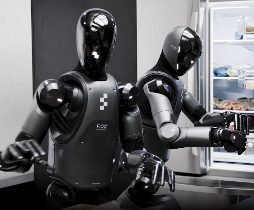

# Figure AI Helix 系统总结

## 硬件组成
 

1. 感知系统：Figure 02的头部、前躯干和后躯干共配备6个RGB摄像头
2. 决策系统：嵌入式控制板及2块板载低功耗GPUs（NVIDIA RTX GPU，具体型号暂不明确）[参考来源](https://blogs.nvidia.com/blog/figure-humanoid-robot-autonomous/)
3. 执行系统：人形上身，腰部+头部+双臂共35个关节（从照片推测，头2 + 腰3 + 臂7x2 + 手16x2），部分手部自由度应该没有用到

## 网络结构

VLA网络由解耦的两个系统——预训练视觉语言模型（S2） + 控制小模型（S1）组成，两者在各自的时间尺度上运行，结合VLM模型广泛通用但不够快的特点和视觉运动策略快速而不广泛的特点，实现一个既广泛又快速的VLA控制模型。

### S2
参数量：7B  
类型：开源VLM  
输入：RGB图片、关节角信息  
输出：潜空间向量  
输出频率：7-9Hz  
作用：场景理解和语义理解，提供跨物体和场景的泛化能力，将所有与语义任务相关的信息提炼到一个单一的连续潜在向量中，并将其传递给S1 

### S1
参数量：80M  
类型：交叉注意力的编解码Transformer网络，依赖一个多尺度的全卷积视觉骨干进行视觉处理（在仿真器中预训练初始化*）  
输入：潜空间向量、RGB图片、关节角  
输出：高频机器人动作（关节角）  
输出频率：200Hz  
作用：快速灵巧的控制策略，结合图像编码和当前关节角信息，将潜空间向量表示转化成连续的机器人动作（目标关节角）  

### 训练细节：
训练数据：约500h的高质量、多机器人、多操作员的多样化遥操作行为数据集  
训练方法：基于raw pixel和文本指令到连续动作的映射，做端到端的训练，采用标准的回归损失。梯度从S1通过潜表示向量传递到S2，实现两者的协同优化。  
> 注意：  
> - S1和S2在训练阶段是耦合的  
> - 为了模拟真实的推理延迟，在训练阶段认为引入了S1和S2输入量的时间偏移*  

### 调优的流式推理
S1和S2分别运行在一块专门的GPU上，基于共享的内存形成一个生产者-消费者模型。  
S2异步地处理最新的观测信息和自然语言指令， 持续地生成编码了高维意图行为意图的潜向量，并更新到共享内存中。  
S1在独立线程中，结合最新观测和自然语言指令，消费共享内存中的潜向量生成连续的机器人动作。由于S1比S2有更高的推理速度，因此有更高的时间分辨率，从而可以实现更紧密的闭环实时控制。  

## 数据流与传输带宽
### 数据流
  
Sensor以20Hz的频率采集图像和关节角。  
Observation（raw_img） ────传感器图像────>多尺度立体视觉网络 ────合并图像特征────> Observation（combind_img_token）  
Observation（command + state + combind_img_token）────7~9Hz观测信息────> S2 ────7~9Hz潜向量────> S1 ────200Hz动作────>执行器  
Observation（command + state + combind_img_token）─────20Hz观测信息────> S1  

### 传输带宽  
未提及

## 特色
[官方观点](https://www.figure.ai/news/helix)：
1. 全身控制：它是历史上第一个类人机器人上半身的高速连续控制 VLA 模型，覆盖手腕、躯干、头部和单个手指；
2. 多机器人协作：可以两台机器人用同样的模型控制协作，完成前所未见的任务； 
3. 抓取任何物品：可以捡起任何小型物体，包括数千种它们从未遇到过的物品，只需遵循自然语言指令即可；
4. 单一神经网络：Helix 使用一组神经网络权重来学习所有行为，如抓取和放置物品、使用抽屉和冰箱、以及跨机器人交互，而无需任何任务特定的微调；
5. 本地化：Helix 是史上第一个在板端 GPU 运行的机器人 VLA 模型，已经具备了商业化落地能力。
6. 扩展到家用场景成本低：相比于传统的依据单个任务由机器人专家定制化的控制和需要采集大量数据的模仿学习控制，借助VLM模型实现强大泛化能力的端到端模型更有优势

[量子位观点](https://mp.weixin.qq.com/s/ZkY0IYETGXXDixuo-wKekA)
1. 空间感知：多相机实现隐式立体视觉与多尺度视觉表示，增强了3D空间感知和场景理解精度
2. 执行速度上限高：在物流场景的微调应用中使用简单的test-time加速技术（同样的waypoint以更短的时间间隔执行），保持高成功率的同时实现了更快的执行速度。
3. 微调成本低：仅用8小时精心挑选的数据就能训练出一个灵活且适应性强的策略。
4. 引入视觉自校准模型：该模型可以让每个机器人通过自身的视觉输入来自我校准，估算出机械臂末端的精确位置和姿态，提高跨机器人实例的泛化能力。
5. 存在自纠正能力：训练过程中，Figure排除了那些较慢的、遗漏的或失败的案例，不过特意保留了包含纠正行为的案例。
6. 默认交互方式为语音交互

个人判断：
1. 采用七自由度冗余机械臂，工作空间更大，由于是端到端的模型，不存在FK/IK，多一个自由度对模型来说区别不大，但效果会好很多
2. 暂不能实现跨构型的泛化能力，但是针对不同的执行器和机器人构型，不需要改变模型架构，只需要改变输出参数的数量重新采集数据训练模型