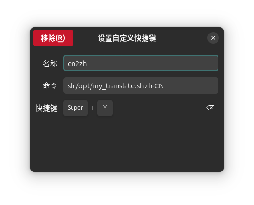
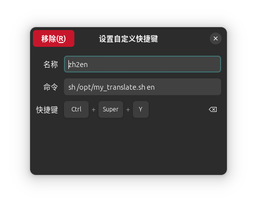

## 0. 原理介绍
该方案先通过xclip获取用户选中的文本内容，对文本进行清理（移除隐藏字符,html标签,换行符），然后通过调用翻译 API（如谷歌翻译或其他服务）将文本翻译为目标语言，最后使用系统通知工具（notify-send）将翻译结果以通知的形式显示给用户。

## 1. 安装依赖

```shell
sudo apt install xcilp jq 
```
xcilp 用于获取剪贴板内容
jq 用于对字符串进行 URL 编码（百分号编码）

## 2. 编写脚本

在/opt目录下新建一个名为my_translate.sh的脚本文件
```bash
sudo nano /opt/my_translate.sh
```
添加以下内容并保存退出：


```bash

#!/bin/bash

# 从剪贴板获取选中的文字
selected_text=$(xclip -o)

clean_text=$(echo "$selected_text" | sed 's/<[^>]*>//g' | tr -d '\n\r' | tr -d '\t' | tr -s ' ')

echo $clean_text

# 检查目标语言参数
target_language="$1"

# 谷歌翻译API的URL
API_URL="https://translate.googleapis.com/translate_a/single?client=gtx&sl=auto&tl=$target_language&dt=t&q="
query=$(echo -n "$clean_text" | jq -sRr @uri)

# 调用Google Translate API
response=$(curl -sL "${API_URL}${query}")

## just for debug
#echo "完整请求 URL: ${API_URL}${query}" >> debug_log.txt
#echo "API 响应: $response" >> debug_log.txt

# 提取翻译结果
translation=$(echo $response | awk -F'"' '{print $2}')

echo $translation

# 发送通知
notify-send "Translate Rerult ($target_language): " "$translation"

```


添加运行权限
```shell
sudo chmod +x /opt/my_translate.sh
```

## 3.快捷键设置

在`设置/键盘/键盘快捷键`中添加两个自定义快捷键(en->zh, zh->en)：

 

注意根据脚本名称对应修改命令